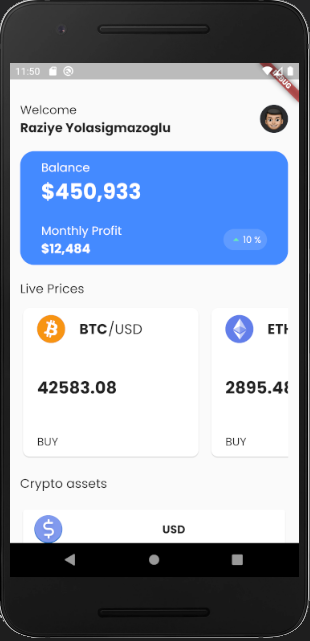
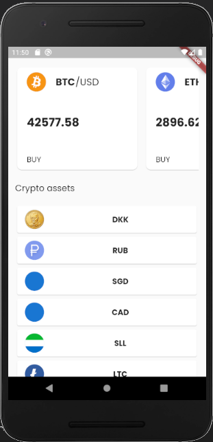
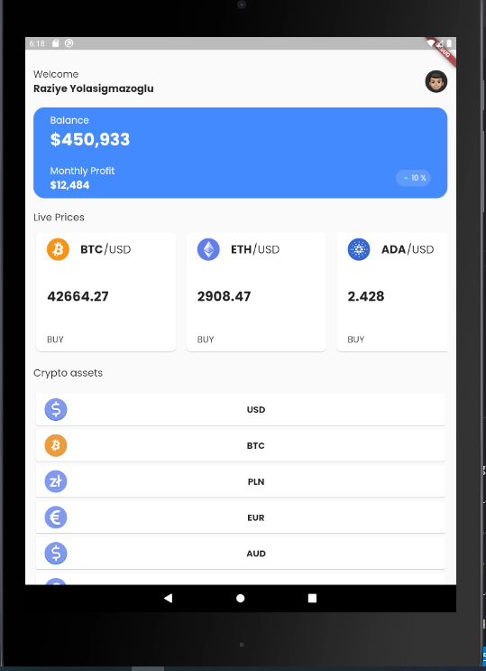

# Crypto Stats

# 3rd Packages
    - dio:  Http Client
    - flutter_bloc : for State Managment 
    - get_it :  for Dependecy injection
    - flutter_launcher_icons:  App's icon managment
    - cached_network_image :  Caching network images

# Widgets
    - Profile: for User information
    - Balance_Card:  for Balance information
    - Live_Prices:  it gets live data from webscoket channel
    - Crypto_assets:  it gets crypto name and icon from rest api
    - Cached_circle_avatar: to cache crypto icons

# Environments
    I used Visual Studio Code 1.60.1
    Flutter 2.5.0 • channel stable 
    Dart 2.14.0

# How to run

    First, Android Studio -> AVD Manager -> run select device

    Second, VS Code termial: flutter run -d 'device_name'
   
# Images

    <table>
        <tr>
            <td style="text-align: center">
                    
            </td>            
            <td style="text-align: center">
                    
            </td>                     
        </tr>
        <tr>
            <td style="text-align: center">
                    
            </td>                                
        </tr>
    </table>

